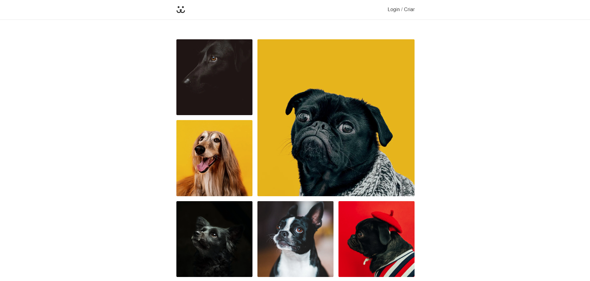

<h1 align="center">Dogs Next</h1>

<h2> :scroll: Descrição</h2>

  Nesse projeto eu refiz o site Dogs, mas dessa vez com NextJS, ele é o mesmo que o anterior  mas por usar outra técnologia fez com que eu precisase pesquisar mais.

<h2> :computer: Build</h2>

  <li>NextJS</li>
  <li>React</li>
  <li>TypeScript</li>

<h2> :framed_picture: Thumb</h2>

<a href="https://dogs-next-tan.vercel.app/" target="_blank">Accese aqui</a>
